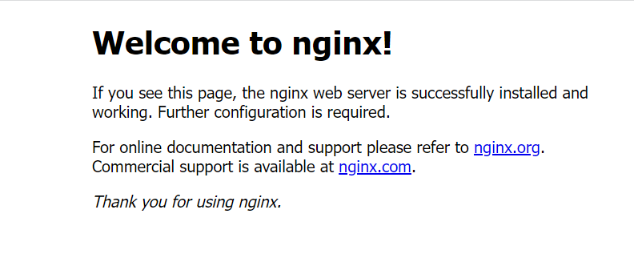

## `Primeiros passos com Kubernetes - Parte II`


1. Visualizando nosso POD criado:

```
# kubectl get pods
NAME    READY   STATUS    RESTARTS   AGE
nginx   1/1     Running   0          77m
```

1.1. Vamos verificar se a orta esta ativada no nosso arquivo `yml`:

```
# kubectl describe pods nginx |  grep -i port
    Port:           80/TCP
    Host Port:      0/TCP
```

2. Agora que temos nosso POD criado e rodando, vamos expor esse servico do NGINX para fora:

```
# kubectl expose pod nginx
service/nginx exposed
```

2.1. Verificando nosso servico

- veja que eu tenho agora um servico criado do nginx:

```
# kubectl get service
NAME         TYPE        CLUSTER-IP       EXTERNAL-IP   PORT(S)   AGE
kubernetes   ClusterIP   10.96.0.1        <none>        443/TCP   46h
nginx        ClusterIP   10.108.241.165   <none>        80/TCP    36s
```

2.2. Se eu executar o comando `curl` em cima desse IP, veja que ele devolve a pagina de welcome do NGINX:

```
# curl 10.108.241.165
<!DOCTYPE html>
<html>
<head>
<title>Welcome to nginx!</title>
<style>
html { color-scheme: light dark; }
body { width: 35em; margin: 0 auto;
font-family: Tahoma, Verdana, Arial, sans-serif; }
</style>
</head>
<body>
<h1>Welcome to nginx!</h1>
<p>If you see this page, the nginx web server is successfully installed and
working. Further configuration is required.</p>

<p>For online documentation and support please refer to
<a href="http://nginx.org/">nginx.org</a>.<br/>
Commercial support is available at
<a href="http://nginx.com/">nginx.com</a>.</p>

<p><em>Thank you for using nginx.</em></p>
</body>
</html>
```

2.3. Descrevendo nosso servico do NGINX:

```
# kubectl describe services nginx
Name:              nginx
Namespace:         default
Labels:            run=nginx
Annotations:       <none>
Selector:          run=nginx
Type:              ClusterIP
IP Family Policy:  SingleStack
IP Families:       IPv4
IP:                10.108.241.165
IPs:               10.108.241.165
Port:              <unset>  80/TCP
TargetPort:        80/TCP
Endpoints:         10.36.0.1:80
Session Affinity:  None
Events:            <none>
```

2.4. Agora vou editar meu servico do NGINX para export meu IP para fora do cluster

- ele abre o editor `VIM` e fornece edicao do meu servico

```
# kubectl edit service nginx
service/nginx edited
```

2.5. Agora voce pode verificar que ele mudou o meu tipo de servico para `NodePort`:

```
# kubectl get service
NAME         TYPE        CLUSTER-IP       EXTERNAL-IP   PORT(S)        AGE
kubernetes   ClusterIP   10.96.0.1        <none>        443/TCP        46h
nginx        NodePort    10.108.241.165   <none>        80:32110/TCP   5m42s
```

- veja que agora eu posso ver meu servico exportado para fora do meu cluster:




